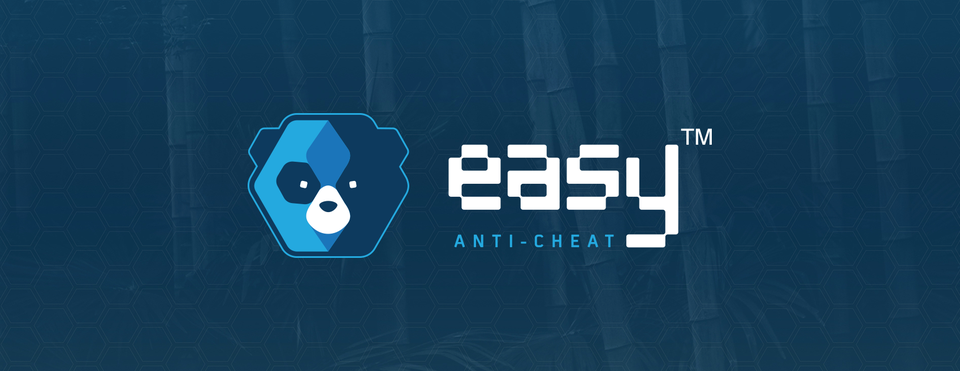

In early 2025, our team embarked on an exciting research journey at Royal Holloway, University of London (RHUL). Under the visionary leadership of Professor Konstantinos Markantonakis, a leading figure in cybersecurity, we have just initiated a project focused on developing AI-driven anticheat systems.

Project Overview
Our initiative, AI Shield: Next-Gen Anticheat Research Assistant, aims to revolutionize digital security by leveraging advanced machine learning to detect and mitigate cheating in online platforms. Although we are in the early stages, our goal is to create a system that performs real-time analysis and anomaly detection, setting a new benchmark for cybersecurity.

Research Objectives
Detecting Cheating Patterns: Develop algorithms that analyze user behavior to identify anomalies indicative of cheating.
Enhancing Cybersecurity Protocols: Integrate AI with existing security measures to strengthen defenses against evolving digital threats.
Real-Time Response: Build a framework capable of processing and responding to potential threats immediately.
Methodology and Technology
Our approach combines the strengths of interdisciplinary collaboration and cutting-edge technology:

Data Collection & Analysis: We are compiling diverse datasets to train our AI models on various cheating scenarios.
Algorithm Development: Using frameworks such as Python and TensorFlow, we’re designing neural network models that balance complexity with efficiency.
System Integration: We aim to create a modular architecture that seamlessly integrates AI functionalities with established cybersecurity protocols.
Early Challenges
As with any pioneering research, we face several challenges:

Data Diversity: Capturing a comprehensive range of cheating behaviors to train robust models.
Algorithm Efficiency: Ensuring our sophisticated models can operate in real-time without compromising performance.
Collaborative Coordination: Bridging expertise across disciplines to align on research objectives and technical strategies.
Early Insights and Future Directions
While our work is still at its inception, preliminary experiments have shown promising trends. These early insights reinforce our commitment to developing a scalable and robust anticheat system. As we continue to refine our methodologies and expand our data resources, we remain optimistic about the impact our research will have on the future of cybersecurity.

Reflections
Being part of this cutting-edge research project has been both challenging and inspiring. Under Professor Markantonakis's expert guidance, I have gained invaluable insights into the intersection of AI and cybersecurity. The collaborative spirit at RHUL has set a strong foundation for innovation, and I am eager to share more updates as our work on AI anticheats implementation progresses.

Stay tuned for more developments as we continue to explore and redefine the boundaries of digital security.

