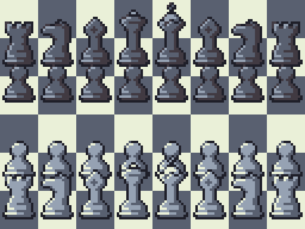

# ZyChess README
================

## Project Overview
### Project Name and Description
ZyChess is a Python-based chess game that utilizes the pygame library for graphics. It features a range of functionalities, including game restart, piece handling, checkmate and stalemate detection, and move generation.
[](https://www.python.org/)
[](https://www.pygame.org/)
[](https://github.com/Aerovity/ZyChess/blob/main/LICENSE)

### Key Features
* Implementation of chess game logic using Python
* Utilization of pygame for graphics and user interface
* Functions for handling different types of pieces and generating possible moves
* Detection of checkmate and stalemate conditions
* Ability to restart the game

## Quick Start
To get started with ZyChess, follow these minimal setup instructions:
1. Install Python and the required pygame library using `pip install pygame`.
2. Clone the repository using `git clone https://github.com/Aerovity/ZyChess.git`.
3. Run the game using `python ZyzouChess.py`.

## Installation
### Prerequisites
* Python installed on your system (version 3.9 or higher)
* Pygame library installed (`pip install pygame`)

### Installation Steps
1. Clone the repository using `git clone https://github.com/Aerovity/ZyChess.git`
2. Navigate to the project directory using `cd ZyChess`
3. Install the required pygame library using `pip install pygame`
4. Run the game using `python ZyzouChess.py`

## Usage Examples
### Basic Examples
```python
# Run the game and use the graphical interface to make moves
python ZyzouChess.py

# Use the restart function to start a new game
# (available in the game's graphical interface)
```

### Common Use Cases
* Playing a game of chess against another player or the computer
* Testing and debugging chess game logic
* Customizing the game's graphics and user interface

## API Docs
### Game Logic Functions
The game logic is implemented in the `ZyzouChess.py` file and includes functions for:
* Handling different types of pieces
* Generating possible moves
* Detecting checkmate and stalemate conditions

### Pygame Functions
The pygame library is used for graphics and user interface. The game utilizes the following pygame functions:
* `pygame.init()` to initialize the pygame library
* `pygame.display.set_mode()` to set the display mode
* `pygame.event.get()` to handle events

## Build & Deployment
### Building the Game
To build the game, follow these steps:
1. Clone the repository using `git clone https://github.com/Aerovity/ZyChess.git`
2. Navigate to the project directory using `cd ZyChess`
3. Install the required pygame library using `pip install pygame`
4. Run the game using `python ZyzouChess.py`

### Deployment
The game can be deployed on any system that supports Python and the pygame library.

## Contribution Guide
### Contributing to ZyChess
To contribute to ZyChess, follow these steps:
1. Fork the repository using `git fork https://github.com/Aerovity/ZyChess.git`
2. Clone the forked repository using `git clone https://github.com/your-username/ZyChess.git`
3. Make your changes and commit them using `git commit -m "your commit message"`
4. Push your changes to the forked repository using `git push origin your-branch-name`
5. Submit a pull request to the main repository

### Code Style Guidelines
* Ensure that your code is well-documented and follows standard Python conventions
* Include type hints and docstrings for all functions and classes
* Use consistent indentation and spacing throughout the code

### License
This project is licensed under the terms of the [MIT License](https://github.com/Aerovity/ZyChess/blob/main/LICENSE). Please review the license agreement before using or contributing to the project.